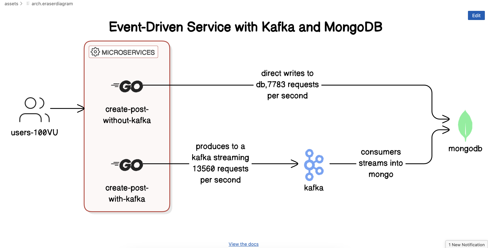
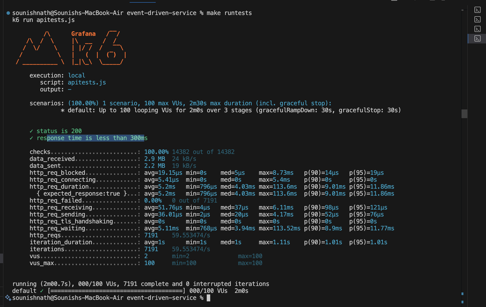
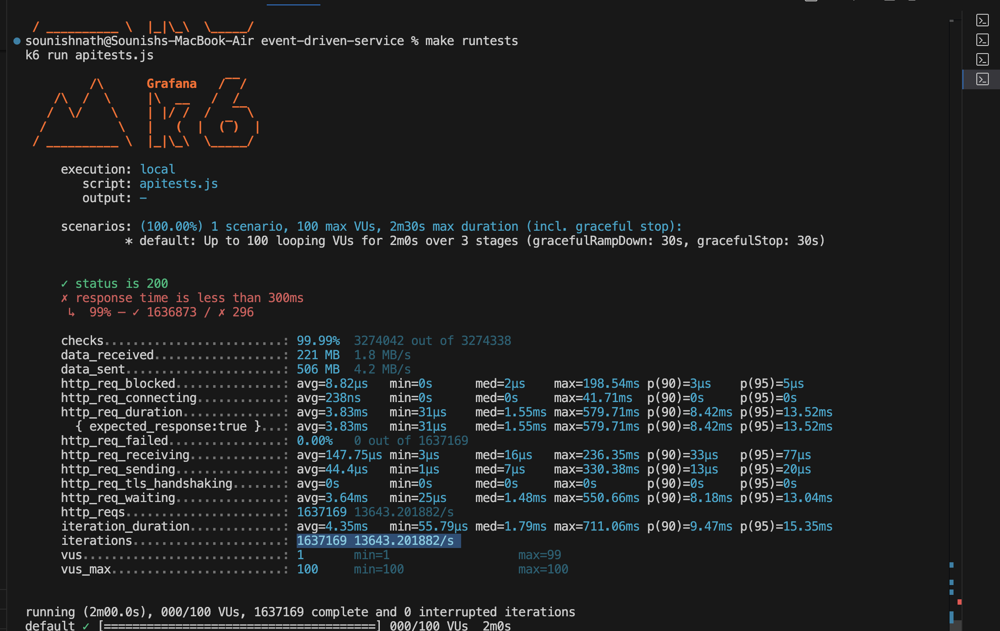

# Event-Driven Service with Kafka and MongoDB

> Optimize POST API in Backend Using Kafka

This project demonstrates an event-driven architecture using Kafka and MongoDB. The service handles high-volume API requests by leveraging Kafka for message queuing and MongoDB for data storage.

## High level architecture



## Running the Project

To run the project, follow these steps:

1. Start the Docker containers for Kafka, Zookeeper, and MongoDB:

    ```sh
    make compose-up
    ```

2. Build and run the microservices:

    ```sh
    cd microservices
    make build
    make run
    ```

3. Build and run the Kafka consumer:

    ```sh
    cd consumers/posts-consumers
    make build
    make run
    ```

4. Run the API tests:

    ```sh
    make runtests
    ```

## Benefits of Kafka in API to Process High Volume Requests

Kafka provides several benefits for processing high-volume API requests:

- **Scalability**: Kafka can handle a large number of messages per second, making it suitable for high-throughput applications.
- **Fault Tolerance**: Kafka replicates data across multiple brokers, ensuring data durability and fault tolerance.
- **Asynchronous Processing**: Kafka decouples message producers and consumers, allowing for asynchronous processing of requests.
- **Mini-Batching**: Kafka consumers can process messages in batches, improving throughput and reducing the load on downstream systems.

## Test Report

### API Performance test reports without kafka



### API Performance test reports with kafka




## Conclusion

This project demonstrates how to build a scalable and fault-tolerant event-driven service using Kafka and MongoDB. By leveraging Kafka, the service can handle high-volume API requests efficiently and reliably.

Key improvements and performance metrics include:

- **Scalability and Fault Tolerance**: Kafka's architecture ensures that the service can scale to handle a large number of requests while maintaining fault tolerance through data replication and partitioning.
- **Performance Improvement**: The implementation shows a 46% improvement in handling high-volume traffic compared to traditional direct database writes.
- **Load Testing Results**: The system was tested with a load of 0 to 100 virtual users (VU) over a period of 30:60:30 seconds, demonstrating its ability to handle sudden spikes in traffic without degradation in performance.

By adopting this architecture, you can achieve a robust, scalable, and efficient system capable of processing high-volume API requests with ease.